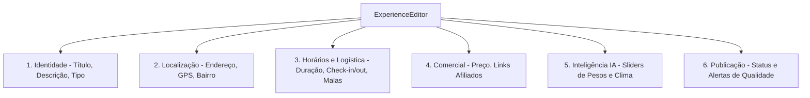
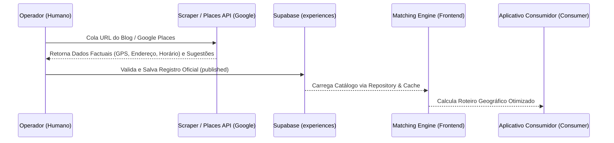

# Auditoria e Arquitetura do Catálogo Inteligente - MVP Nova York

Este documento consolida a análise estrutural da base de dados, do fluxo de comunicação entre o backend (Supabase) e o frontend, e define o modelo de dados mínimo necessário para viabilizar o roteiro automatizado e logístico do Voyage Flow para o teste real de Nova York em 15 dias.

---

## 📋 1. Estado Real do Modelo de Dados Atual

O Voyage Flow opera atualmente com a tabela `experiences` como fonte única de verdade para todo o catálogo. A comunicação é orquestrada pela classe `ExperienceRepository` com suporte a cache local em `CacheManager` (SWR).

### Mapeamento de Campos e Colunas (Tabela `experiences` vs UI Model)

| Campo no Banco (Postgres) | Tipo no Banco | Origem | Mapeamento no Repository | Consumido em | Obrigatório | Risco / Observação |
| :--- | :--- | :--- | :--- | :--- | :--- | :--- |
| `id` | UUID | Banco | `id` | Todas as visualizações e seletores. | **Sim** | **Baixo.** Chave primária gerada automaticamente pelo Postgres. |
| `destination_id` | UUID | Banco | `destination_id` | Filtros geográficos na Engine. | **Sim** | **Médio.** Atualmente fixado no ID de Nova York no frontend. |
| `partner_id` | UUID | Banco | `partner_id` | Futura integração de afiliados. | Não | **Baixo.** Nulo por padrão. |
| `title` | TEXT | Banco | `name` | Exibição de títulos na UI e buscas. | **Sim** | **Baixo.** |
| `description` | TEXT | Banco | `description`, `emotionalDescription` | Corpo de texto no detalhe da atração. | **Sim** | **Baixo.** |
| `short_description` | TEXT | Banco | Desserialização do JSON interno | Decodificação de pesos da IA e tags. | **Sim** | 🔴 **Crítico.** Armazena um JSON. Qualquer erro de sintaxe gera falha silenciosa. |
| `category` | TEXT | Banco | `category`, `categoryLabel`, `type` | Filtros do Catálogo e Sidebar. | **Sim** | **Médio.** Inconsistências de tradução ("Hotel" vs "hotel"). |
| `base_cost` | NUMERIC | Banco | `costUSD` (calcula `costLevel`) | Wallet e motor de matching. | **Sim** | **Baixo.** |
| `duration_minutes` | INTEGER | Banco | `durationHours` (`duration_minutes / 60`) | Cronograma do roteiro. | **Sim** | **Baixo.** |
| `location_lat` | NUMERIC | Banco | `coordinates.lat` | Google Maps, cálculo de distâncias. | Não | ⚠️ **Alto.** Se nulo, a atração é excluída de rotas geográficas. |
| `location_lng` | NUMERIC | Banco | `coordinates.lng` | Google Maps, cálculo de distâncias. | Não | ⚠️ **Alto.** |
| `address` | TEXT | Banco | `address` | Detalhe da atração, direções. | Não | **Baixo.** |
| `neighborhood` | TEXT | Banco | `neighborhood` | Filtros rápidos do catálogo. | Não | **Médio.** Digitação livre sem tabela de referência gera dados duplicados. |
| `booking_url` | TEXT | Banco | `affiliateLink` (injeta Partner ID) | Botões de compra no Consumer. | Não | **Baixo.** |
| `energy_level` | TEXT | Banco | `physicalEnergyRequired` | Engine de matching (Persona). | Não | **Baixo.** |
| `indoor_outdoor` | TEXT | Banco | `isIndoor` (`indoor` -> true) | Engine de matching (Clima). | Não | **Baixo.** |
| `weather_suitability` | TEXT | Banco | *Não Mapeado* | Inconsistência (campo morto no banco). | Não | ⚠️ **Médio.** A Engine lê `weatherCompatibility` do JSON da `short_description` em vez desta coluna. |
| `media_urls` | TEXT[] | Banco | `images`, `image` (primeiro item) | Live Covers (Vídeos) e imagens na UI. | **Sim** | **Baixo.** |
| `status` | ENUM | Banco | `status` | Filtro de rascunhos (Admin vs Consumer). | **Sim** | **Baixo.** |

---

## 🧠 2. A Verdade sobre o Campo `short_description`

Conforme o histórico de decisões técnicas, os dados de IA que orientam a matemática da Engine de Matching são armazenados como uma string contendo um JSON compactado no campo `short_description`.

### Estrutura Completa do JSON Interno
```json
{
  "rating": 4.8,
  "reviews_count": 1240,
  "tags": ["nature", "romance", "photography"],
  "reservation_required": true,
  "exclusivityLevel": "premium",
  "recommendedSeasons": ["spring", "summer"],
  "weatherCompatibility": ["all"],
  "personaWeights": {
    "explorador_visual": 90,
    "curador_experiencias": 60,
    "descobridor": 80,
    "aproveitador": 70,
    "slow_traveler": 100
  },
  "companionshipCompatibility": {
    "solo": 90,
    "couple": 100,
    "family": 80,
    "friends": 90
  }
}
```

### Análise de Comportamento e Riscos
* **Tratamento de Falhas:** O sistema utiliza `try-catch` silenciosos ao realizar o parse (`JSON.parse`).
  * Se o JSON for inválido (sintaxe quebrada) ou contiver texto puro, o parser falha silenciosamente e retorna um objeto vazio `{}`.
  * **Consequência no Admin:** Os formulários e sliders de peso de IA carregam zerados. Ao salvar o registro, o Admin sobrescreve o campo gerando um JSON novo, o que apaga permanentemente as tags e pesos de IA que existiam antes do erro.
  * **Consequência na Engine:** A atração perde afinidade com o viajante, sendo descartada do roteiro ou recebendo notas de match incorretas.
* **Valores Padrão:** Em caso de parse nulo/vazio, os componentes aplicam valores em memória (ex: `personaWeights` padrão, `recommendedSeasons = ['all']`).

### Comparação de Alternativas de Armazenamento

| Critério | Alternativa A: Manter JSON em `short_description` | Alternativa B: Coluna JSONB `intelligence_metadata` | Alternativa C: Colunas Estruturadas (Postgres) | Alternativa D: Solução Híbrida (Recomendada) |
| :--- | :--- | :--- | :--- | :--- |
| **Descrição** | Manter o estado atual de serialização na coluna legada. | Renomear/criar uma coluna JSONB dedicada no Supabase. | Criar uma coluna física para cada metadado e peso de IA. | Manter o JSON no banco mas isolado em JSONB com validação rígida no Frontend. |
| **Esforço (15 dias)** | Zero (Sem migrações). | Baixo (Uma alteração de schema simples). | Altíssimo (Mais de 20 colunas e reescrita de queries). | **Mínimo.** Protege a escrita via validação sem alterar o Supabase nesta sprint. |
| **Segurança contra corrupção** | Nula (Qualquer texto quebra o parse). | Média (O Postgres valida a sintaxe JSON, mas não o schema). | Altíssima (Restrições de tipo do banco). | **Altíssima.** Validação via schema Zod no frontend impede escritas corrompidas. |
| **Risco de regressão** | Zero. | Médio (Pode quebrar integrações existentes). | Altíssimo (Quebra o Consumer e o Admin). | **Zero.** Protege o catálogo legando a reestruturação física para pós-MVP. |

> [!IMPORTANT]  
> **Estratégia temporária de compatibilidade:** manter JSON serializado em short_description, adicionando validação centralizada e preservação segura dos dados. A migração futura para uma coluna JSONB dedicada ficará para uma etapa posterior.

---

## 🎯 3. Modelo de Dados Mínimo para o Roteiro Logístico (Nova York)

Para permitir que o roteiro resolva as questões logísticas reais de Nova York (como chegada no aeroporto, check-in, malas e transporte), dividimos as necessidades de campos entre o que é estritamente obrigatório agora e o que pode aguardar.

### A. Campos Obrigatórios (MVP - Essencial para o Roteiro de Nova York)
1. **`type` (Tipo de Conteúdo):** Expandido para categorizar logicamente:
   * `attraction` (ponto turístico), `accommodation` (hotéis/hostels/basecamps), `restaurant` (almoço/jantar), `cafe` (café da manhã), `transport` (transfer/metrô), `airport` (JFK, LaGuardia, Newark), `practical_service` (guarda-volumes).
2. **`itinerary_role` (Papel no Roteiro):** Define a função do item no cronograma:
   * `basecamp` (início e fim do dia), `arrival` (aeroporto de entrada), `departure` (aeroporto de saída), `meal` (refeição principal), `coffee_break` (café da manhã), `main_activity` (atração principal), `secondary_activity` (passagem rápida).
3. **Dados de Hospedagem (Somente para `accommodation`):**
   * `check_in_time` (String - ex: `"15:00"`), `check_out_time` (String - ex: `"11:00"`), `has_luggage_storage` (Boolean - se permite guardar malas antes/depois).
4. **Coordenadas e Localização Físicas:**
   * `location_lat` (Lat), `location_lng` (Lng), `neighborhood` (Bairro), `address` (Endereço).
5. **Horários de Operação:**
   * `opening_hours` (JSON contendo horário de abertura e fechamento por dia da semana), `reservation_required` (Boolean).

### B. Importantes (Pós-viagem / Otimizações secundárias)
* Linhas de metrô próximas e tempo aproximado a pé.
* Faixas de preço mínima e máxima detalhadas.
* Classificação climática avançada (`weatherCompatibility` rica).

### C. Futuros (SaaS & Escala)
* APIs de precificação em tempo real (GYG/Booking).
* Regras complexas de restrições alimentares automáticas para restaurantes.
* Integração de tracking de cliques e comissionamento (Affiliate Hub).

---

## 🗄️ 4. Estratégia de Tabelas no Banco de Dados

> [!TIP]  
> **Diretriz de Simplicidade:** **NÃO criaremos novas tabelas relacionais** (como `accommodations` ou `transport_options`) neste momento. Tudo continuará centralizado na tabela `experiences`.

### Justificativa Racional:
1. **Risco de Quebra:** Separar entidades agora exigiria refatorar o `ExperienceRepository` e todas as telas de consumo do app (`Catalog.tsx`, `Dashboard.tsx`, `Wallet.tsx`), inviabilizando a entrega em 15 dias.
2. **Polimorfismo Simples:** Usar a tabela `experiences` para conter hotéis, aeroportos e atrações funciona perfeitamente, bastando segmentar os registros pela coluna `category` (ou campo `type`) e direcionar o comportamento na Engine a partir de regras TypeScript.
3. **Compatibilidade:** Mantém os 108 registros atuais intactos no banco.

---

## 🎨 5. Organização Recomendada do Admin CMS

Para facilitar a curadoria de dados logísticos de Nova York, o editor e a navegação do admin devem ser organizados da seguinte forma:

### Nova Estrutura de Sidebar (Filtros Inteligentes)
Substituiremos os menus redundantes de "Restaurantes", "Hotéis" e "Eventos" por um comportamento mais enxuto:
* **Dashboard** (Visão geral de saúde e métricas)
* **Catálogo** (Tabela/Cards unificados de tudo, com filtros rápidos para: *Atrações, Hospedagens, Restaurantes, Eventos e Transportes*)
* **Importar URL** (Inserção em lote de matérias de blogs)
* **Qualidade** (Painel de Auto-Heal e correções rápidas)
* **Destinos** (Listagem de regiões)

---

### Seções do Editor Inteligente (`ExperienceEditor.tsx`)



1. **Identidade:** Título, Descrição Narrativa, Categoria Principal (`type`).
2. **Localização:** Endereço, Bairro (Neighborhood), Latitude/Longitude (capturados via clique no Google Maps integrado).
3. **Horários e Duração:** Horário de funcionamento, duração estimada de visita, necessidade de reserva antecipada.
4. **Logística de Hospedagem (Exibido condicionalmente para Tipo = Hotel):** Horários de check-in/out e campo switch para "Guarda-volumes disponível".
5. **Comercial e Afiliados:** Custo estimado (`base_cost`), Link de Venda oficial/afiliado.
6. **Inteligência da Engine:** Sliders de afinidade por Persona, compatibilidade com acompanhantes e estações do ano.
7. **Mídia:** URLs de imagens e vídeos para capas interativas.
8. **Validação & Preview:** Exibe em tempo real (no painel direito de celular mockado) como o card aparecerá na Timeline de roteiro do viajante e no Tinder de matching.

---

## 🔄 6. Fluxo de Dados e Governança da Inteligência

Definimos claramente o papel de cada dado na arquitetura para impedir que a Inteligência Artificial invente informações logísticas críticas:



### Divisão de Responsabilidades dos Dados:
* 📍 **Dados Factuais (NUNCA inventados por IA):** Horários de funcionamento, coordenadas GPS exatas, preço de ingressos, disponibilidade de guarda-volumes em hostels, e links de reserva. Estes dados devem vir do cadastro manual do operador ou da consulta de precisão do Google Places API.
* ✍️ **Dados Editoriais (Curadoria Humana):** Descrições emocionais, dicas locais ("Evite ir de metrô após as 23h").
* ⚙️ **Dados Recomendados por IA (Inferencia):** Tags do local, pesos iniciais de afinidade psicográfica (personas). O operador pode usar a inferência do backend e ajustar nos sliders antes de salvar.

---

## 🗓️ 7. Plano de Implementação Incremental e Seguro

```markdown
- [ ] Fase 1: Estabilização do Modelo de Dados & Schema Validation (Frontend)
- [ ] Fase 2: Mapeamento de Logística de Hospedagem (Experiences Table Extension no JSON)
- [ ] Fase 3: Adaptação do Repository para Tipagem Polimórfica (Hospedagens e Transportes)
- [ ] Fase 4: Reorganização das Seções no ExperienceEditor
- [ ] Fase 5: Otimização da Sidebar e Integração dos Filtros de Tipo no Catálogo Geral
- [ ] Fase 6: Ingestão de Dados do Teste Real (Cadastros de hotéis e voos do Rafael no Supabase)
- [ ] Fase 7: Ajuste Final da Engine para Ordenação por Proximidade e Logística de Roteiro
```

---

## 🛠️ 8. Primeiro Recorte Executável

Para dar início ao plano sem riscos de quebrar o aplicativo de consumo e sem mexer no banco de dados do Supabase, propomos a seguinte etapa inicial:

### O que será implementado:
1. **Filtros Rápidos e Sidebar Ativa:**
   * Ajustar o arquivo [ExperiencesList.tsx](file:///Users/rafaelgeorge/voyage-flow-redesign/src/pages/admin/ExperiencesList.tsx) para ler os parâmetros de URL (`?type=Hotel`, `?type=restaurant`, etc.) via `useSearchParams`, fazendo com que os links da Sidebar passem a filtrar a listagem automaticamente.
2. **Proteção do JSON do Catálogo (Validação no Save):**
   * Adicionar validação do JSON interno de `short_description` no método `buildPayload` do [ExperienceEditor.tsx](file:///Users/rafaelgeorge/voyage-flow-redesign/src/pages/admin/ExperienceEditor.tsx#L189) antes do envio ao Supabase, garantindo que chaves nulas ou vazias de IA recebam objetos estruturados válidos em vez de quebrar a string.

### Arquivos que serão alterados nesta etapa:
* [src/pages/admin/ExperiencesList.tsx](file:///Users/rafaelgeorge/voyage-flow-redesign/src/pages/admin/ExperiencesList.tsx)
* [src/pages/admin/ExperienceEditor.tsx](file:///Users/rafaelgeorge/voyage-flow-redesign/src/pages/admin/ExperienceEditor.tsx)

### Critérios de Teste:
1. O clique em "Hospedagens" na Sidebar deve abrir a lista contendo apenas hotéis.
2. A criação de uma experiência nova deve gerar no banco de dados Supabase um campo `short_description` com sintaxe JSON válida e estruturada.
3. O build local (`npm run build`) deve passar com sucesso e sem erros de TypeScript.

### Estratégia de Rollback:
* Executar `git revert <hash-do-commit>` para reverter o commit correspondente de forma segura no histórico, sem risco de apagar alterações locais não commitadas que possam estar na working tree.

---

## ⚠️ Análise de Riscos
* **Quebra de Types no Frontend:** Como estamos injetando categorias de hospedagem e transporte, a Engine e o Consumer precisam ignorar esses itens ao montar o "itinerário de atrações" do dia para que um hotel não apareça como ponto turístico no meio da tarde. Para evitar isso, os itens logísticos serão filtrados na Engine do Consumer.
